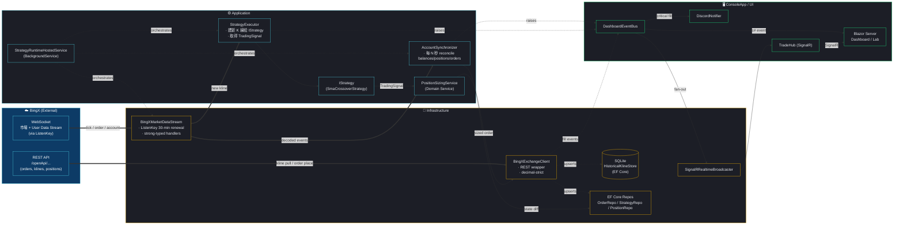
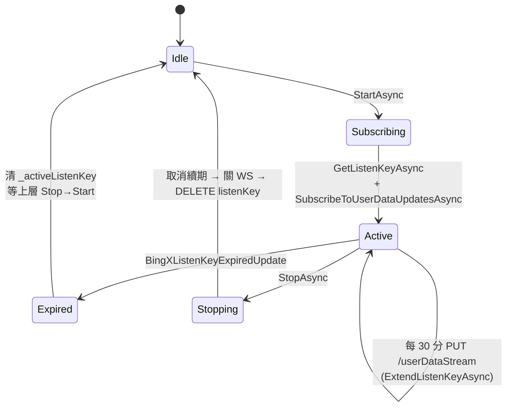
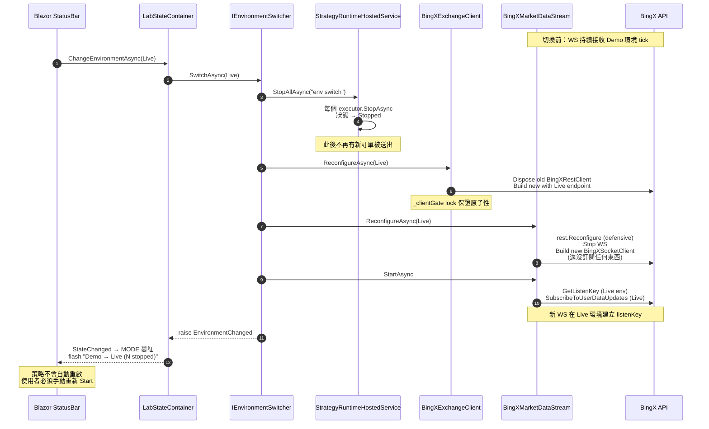
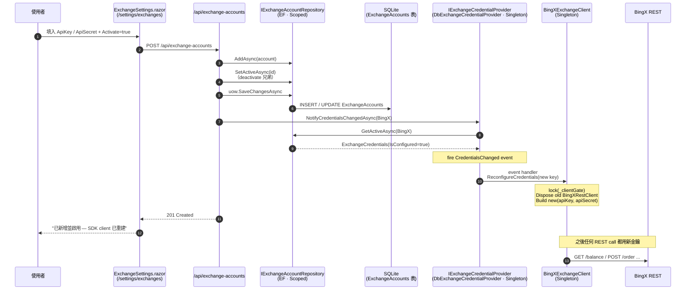
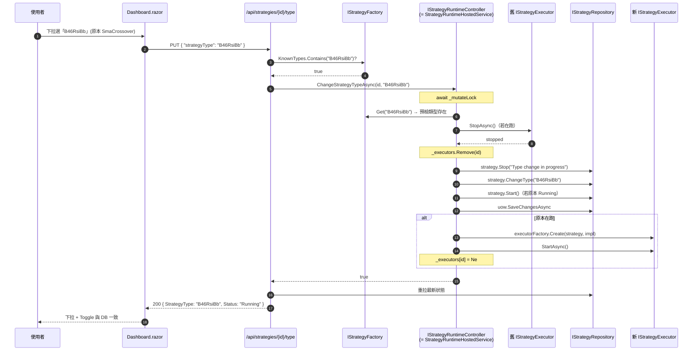
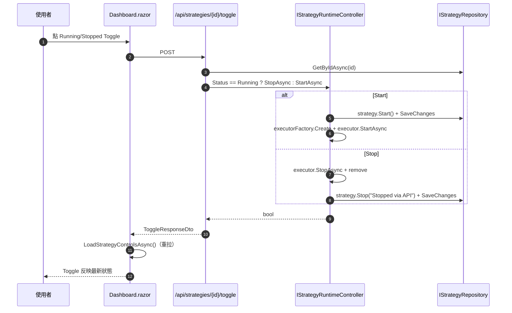

# Data Flow · 從 BingX 到下單與 UI 的全鏈路

> 目標：一張圖看完「市場資料 → 策略訊號 → 風控 → 下單 → 持久化 → 即時推播 UI」整條管線。

## 1. Live Trading 主流程



## 2. Backtest / Optimization 流程（Lab）

```mermaid
sequenceDiagram
    autonumber
    participant U as 使用者 (Blazor /lab)
    participant FB as SmaParameterForm
    participant ST as LabStateContainer
    participant API as Minimal API<br/>POST /api/lab/optimize
    participant ORC as OptimizationOrchestrator
    participant HDP as IHistoricalDataProvider
    participant HKS as IHistoricalKlineStore
    participant OPT as StrategyOptimizer
    participant ENG as BacktestEngine
    participant BUS as DashboardEventBus
    participant HUB as TradeHub (SignalR)

    U->>FB: 調整 Fast/Slow Min/Max/Step
    FB->>ST: ParameterChanged → CurrentGridSize
    U->>API: 點「開始優化掃描」
    API->>ORC: TryStart(OptimizationRequest)
    ORC-->>API: 202 Accepted (gate locked)
    Note over ORC: Task.Run 背景執行

    ORC->>HDP: DownloadAsync(BTC-USDT, 1h, range)
    HDP->>HKS: UpsertAsync(batch) (寫 SQLite)

    ORC->>OPT: RunAsync(ranges, runOne)
    loop 每組參數 (Fast×Slow)
        OPT->>ENG: RunAsync(options, config)
        ENG-->>OPT: BacktestReport
        OPT->>BUS: RaiseOptimizationProgress(done/total, params)
        BUS-->>HUB: SendAsync("OptimizationProgress")
        BUS-->>ST: 直接 c# event
        ST-->>U: StateChanged → 進度條 + ETA
    end

    OPT-->>ORC: List<OptimizationRun>
    ORC->>BUS: RaiseOptimizationCompleted(rankedRows)
    BUS-->>ST: Leaderboard 就位
    ST-->>U: fade-in Leaderboard 表格

    U->>API: 點某列「套用」<br/>POST /api/lab/apply/{strategyId}
    API->>ORC: Stop → UpdateConfiguration → SaveChanges → Start (hot-swap)
    API-->>U: 200 OK
```

## 3. ListenKey 生命週期（補充細節）



> 細節（30-min 而非 40-min、為何 expired 不自動重訂閱）見 `memory/reference_bingx_listenkey.md`。

## 4. 環境切換 (Demo ↔ Live) 資料流

S21 加入的熱切換會**中斷**上面第 1 節主流程，但保證不漏單、不混環境。下面是切換中的資料流快照：



**關鍵：** 整個流程中**沒有任何訂單被送出** — 因為 Runtime 在步驟 3 就全停了，直到使用者在 UI 手動重啟策略。這就是「金融安全」的具體實作。

## 5. 金鑰管理資料流 (S24)

Key 從使用者 UI 輸入到被 SDK 拿去打 REST call 的完整路徑：



### 關鍵保證

- **同交易所至多一筆 Active**：由 `SetActiveAsync` 在同一個 DB transaction 內 deactivate 其他帳號來保證。
- **同步事件 fire**：`NotifyCredentialsChangedAsync` 必須在返回前把所有 handler 跑完，否則 API response 到 UI 的時候 SDK 仍拿舊金鑰。
- **密文不回傳 UI**：`GET /api/exchange-accounts` 對 ApiKey 回 `first4…last4` 預覽、對 ApiSecret 一律 `••••••` 遮罩。
- **空字串保留原值**：`PUT /api/exchange-accounts/{id}` 以空字串送回 secret 不會覆寫 DB（Domain 層 `ExchangeAccount.UpdateCredentials` 保證）。

## 6. 策略大腦熱切換資料流 (S25)

Dashboard 下拉選單換「決策大腦」的完整路徑：



### 6.1 Toggle 路徑（更短）



### 6.2 熱切換安全線

| 動作 | 是否停 executor | 是否改 DB Status | 是否改 Strategy.StrategyType | 是否重建 executor |
|---|---|---|---|---|
| **Toggle → Start** | — | Stopped → Running | — | Yes (新) |
| **Toggle → Stop** | Yes | Running → Stopped | — | — |
| **ChangeType（Running 中）** | Yes | Running → Stopped →（type 換完）→ Running | Yes | Yes (新類型) |
| **ChangeType（Stopped 中）** | — | Stopped（不動） | Yes | — |

Domain 層 `Strategy.ChangeType` 拒絕當 `Status == Running` 時被直接呼叫 — 上表的 Running-中 換腦動作**必須**由 Controller 先翻 Stopped 再換類型。任何繞過 Controller 直接在 Application service 裡改 Type 的程式碼一律違憲。

## 7. 重點不變式

- **WS → Application 必經 Infrastructure 翻譯**：Application 看到的永遠是 `Kline` / `MarketSnapshot` / `Position`，不是 `BingXFuturesAccountUpdate`。
- **DB 寫入永遠走 Repository 介面**，沒有任何路徑直接 `dbContext.SaveChanges()` 跳過抽象。
- **推播是雙通道**：本機 Blazor 走 `DashboardEventBus`（in-process），外部 client 走 SignalR — 兩者由 Orchestrator 同步觸發。
- **回測完全離線**：BacktestEngine 不碰任何外部 API，所有資料來自 `IHistoricalKlineStore`。
- **環境切換 Stop-First**：`IEnvironmentSwitcher.SwitchAsync` 永遠先 `StopAllAsync` 再 `ReconfigureAsync`，順序不可重排。
- **金鑰唯一來源 = SQLite**：Application 層程式碼不得再從 `IConfiguration` 讀 `BingX:ApiKey`；一律透過 `IExchangeCredentialProvider`。
- **Running 中不得換腦**：Domain 層 `Strategy.ChangeType` 強制先 Stop。UI 換型走 Controller 的 Stop-Then-Start 流程。
