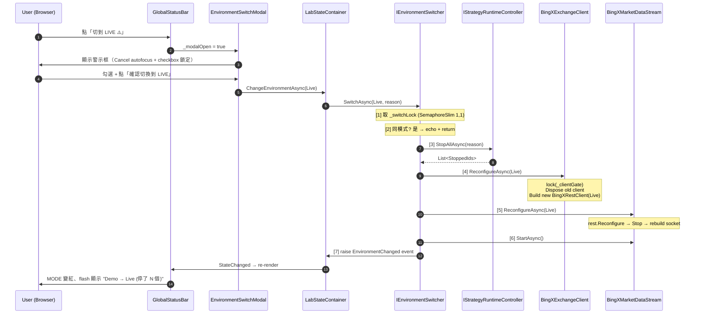

# System Architecture · Clean Architecture 四層相依圖

> 對應 `CryptoBot_Dev_Protocol.md` §1 — 此圖為唯一合法的相依方向。任何 PR 違反此圖視同違憲。

## 1. 全景：四層 + 主要元件

```mermaid
flowchart TB
    %% ─── ConsoleApp 組合根 ───
    subgraph CA["🖥️ ConsoleApp (Composition Root)"]
        direction TB
        Program["Program.cs<br/>BuildApp / DI"]
        Blazor["Blazor Server<br/>Pages · Components"]
        Hub["TradeHub<br/>(SignalR)"]
        Bus["DashboardEventBus<br/>(in-process bus)"]
        Lab["Lab/<br/>StrategyCatalog<br/>LabStateContainer"]
        Orch["OptimizationOrchestrator<br/>(Singleton + Gate)"]
        MinApi["Minimal APIs<br/>/api/lab · /api/strategy · /api/dashboard"]
    end

    %% ─── Application 業務層 ───
    subgraph AP["⚙️ Application (Use Cases)"]
        direction TB
        IStrategy["IStrategy<br/>+ SmaCrossoverStrategy<br/>+ TrendFollowing / MeanReversion / Arbitrage"]
        StratExec["StrategyExecutor<br/>StrategyRuntimeHostedService"]
        Sync["AccountSynchronizer"]
        Backtest["BacktestEngine<br/>StrategyOptimizer"]
        AppIfaces["IExchangeClient<br/>IHistoricalDataProvider<br/>IHistoricalKlineStore<br/>IRealtimeBroadcaster"]
    end

    %% ─── Domain 純核心 ───
    subgraph DM["💎 Domain (Pure Core)"]
        direction TB
        Aggregates["Aggregates<br/>Order · Position · Strategy · Kline"]
        VOs["Value Objects<br/>Symbol · Price · Quantity · Money · Leverage"]
        DomainSvc["Domain Services<br/>PositionSizingService"]
        DomainIfaces["Repositories<br/>IOrderRepository<br/>IStrategyRepository<br/>IPositionRepository"]
        DomainEvents["Domain Events"]
    end

    %% ─── Infrastructure 介面實作 ───
    subgraph INF["🔌 Infrastructure (Adapters)"]
        direction TB
        BingX["BingXExchangeClient<br/>BingXMarketDataStream<br/>(ListenKey lifecycle)"]
        EF["AppDbContext<br/>EF Core + SQLite<br/>Repositories"]
        Hist["HistoricalKlineStore<br/>HistoricalDataProvider"]
        SignalR["SignalRRealtimeBroadcaster<br/>(IHubContext fan-out)"]
        Seeder["InitialStrategySeeder<br/>DiscordNotifier"]
    end

    %% ─── 相依方向（唯一合法）───
    CA -->|references| AP
    CA -->|references| INF
    CA -->|references| DM
    AP -->|references| DM
    INF -->|implements interfaces of| AP
    INF -->|implements interfaces of| DM

    %% ─── 元件間實際呼叫 ───
    Blazor -.subscribes.-> Bus
    Blazor -.injects.-> Lab
    Lab -.subscribes.-> Bus
    Orch -.raises.-> Bus
    Orch -.broadcasts.-> Hub
    MinApi -.invokes.-> Orch
    Orch -.uses.-> Backtest
    StratExec -.uses.-> IStrategy
    Sync -.uses.-> AppIfaces
    BingX -.implements.-> AppIfaces
    EF -.implements.-> DomainIfaces

    classDef domain fill:#1de98233,stroke:#1de982,color:#e6e8ee
    classDef app fill:#4dd0e133,stroke:#4dd0e1,color:#e6e8ee
    classDef infra fill:#f5b30133,stroke:#f5b301,color:#e6e8ee
    classDef host fill:#ff4d6d33,stroke:#ff4d6d,color:#e6e8ee
    class DM,Aggregates,VOs,DomainSvc,DomainIfaces,DomainEvents domain
    class AP,IStrategy,StratExec,Sync,Backtest,AppIfaces app
    class INF,BingX,EF,Hist,SignalR,Seeder infra
    class CA,Program,Blazor,Hub,Bus,Lab,Orch,MinApi host
```



## 2. 為什麼這樣切

| 層 | 職責 | 依賴 | 不依賴 |
|---|---|---|---|
| **Domain** | 業務規則、實體、值物件、Repository **介面** | 只有 BCL | EF / BingX / SignalR / Web 任何東西 |
| **Application** | 用 Domain 編排 use case；定義「需要的能力」介面 | Domain | 任何 Infrastructure 實作 |
| **Infrastructure** | 把外部世界（DB / Exchange / SignalR）翻譯成介面 | Domain + Application | ConsoleApp |
| **ConsoleApp** | DI 組裝、Web Host、Blazor、Hub、Endpoints | 全部三層 | — |

## 3. 元件相依矩陣（簡表）

| 元件 | 屬於 | 主要相依 |
|---|---|---|
| `OptimizationOrchestrator` | ConsoleApp | `IServiceScopeFactory`、`DashboardEventBus`、`IHubContext<TradeHub>` |
| `LabStateContainer` | ConsoleApp/Lab | `DashboardEventBus`、`StrategyCatalog` |
| `BacktestEngine` | Application | `IHistoricalKlineStore`、`IStrategy`、`IExchange` 介面 |
| `BingXMarketDataStream` | Infrastructure | `BingXExchangeClient` (ListenKey REST + WS) |
| `SmaCrossoverStrategy` | Application | 純 Domain 物件，無 IO |

## 4. 環境熱切換 (Hot-Swap) 機制 — S21

S21 加入的動態環境切換不影響上述相依方向，但在 Application 層多了一個編排服務 `IEnvironmentSwitcher`，
專門負責協調 Stop-First → Reconfigure → Restart 的流程。

```mermaid
flowchart TB
    subgraph UI["🖥️ ConsoleApp · Blazor"]
        Status["GlobalStatusBar.razor<br/>(MODE / ACTIVE / ENGINE / SWITCH)"]
        Modal["EnvironmentSwitchModal.razor<br/>(二次確認 + checkbox + autofocus 取消)"]
        Lab["LabStateContainer<br/>(CurrentMode / LastEnvChange)"]
    end

    subgraph App["⚙️ Application"]
        Switcher["IEnvironmentSwitcher<br/>(SemaphoreSlim _switchLock)"]
        Runtime["IStrategyRuntimeController<br/>(StopAllAsync / RunningStrategyIds)"]
        IExch["IExchangeClient<br/>+ TradingMode CurrentMode<br/>+ ReconfigureAsync(mode)"]
        IMD["IMarketDataStream<br/>+ ReconfigureAsync(mode)"]
    end

    subgraph Infra["🔌 Infrastructure · BingX"]
        Rest["BingXExchangeClient<br/>(_clientGate lock<br/>+ BuildRestClient(mode))"]
        WS["BingXMarketDataStream<br/>(_clientGate lock<br/>+ BuildSocketClient(mode))"]
        Opts["BingXOptions (mutable)<br/>EffectiveMode / QuoteAsset (derived)"]
    end

    Status -->|Demo→Live| Modal
    Modal -.confirmed.-> Lab
    Status -->|Live→Demo<br/>(no modal)| Lab
    Lab -->|ChangeEnvironmentAsync| Switcher

    Switcher -->|"[3] StopAllAsync"| Runtime
    Switcher -->|"[4] ReconfigureAsync"| IExch
    Switcher -->|"[5] ReconfigureAsync"| IMD
    Switcher -->|"[6] StartAsync"| IMD
    Switcher -->|"[7] EnvironmentChanged"| Lab

    IExch -.implemented by.-> Rest
    IMD -.implemented by.-> WS
    Rest -.mutates.-> Opts
    WS -.reads.-> Opts

    classDef ui fill:#ff4d6d33,stroke:#ff4d6d,color:#e6e8ee
    classDef app fill:#4dd0e133,stroke:#4dd0e1,color:#e6e8ee
    classDef infra fill:#f5b30133,stroke:#f5b301,color:#e6e8ee
    class Status,Modal,Lab ui
    class Switcher,Runtime,IExch,IMD app
    class Rest,WS,Opts infra
```

### 切換時序（**順序鎖定，不准重排**）



### 安全保證

1. **Stop-First**：`StopAllAsync` 在 `Reconfigure` 之前 — 不可能拿舊環境配置打新環境訂單
2. **不自動重啟策略**：使用者必須手動 Start = 再做一次人為確認
3. **同模式冪等**：避免 UI 連點兩下造成 double-reconfigure
4. **Atomic client swap**：`_clientGate` lock 確保 in-flight RPC 看不到「半切」狀態

## 5. 金鑰持久化層 + UI 控制流 (S24 + S25)

S24 把 API 金鑰從 `appsettings.json` 搬到 SQLite；S25 讓使用者從 Dashboard 手動切策略大腦 / 開關執行狀態。
兩者都不改變四層相依方向，只在既有圖上加了一個 **ExchangeAccount Aggregate** 和兩個 Dashboard 控制元件。

```mermaid
flowchart TB
    subgraph UI["🖥️ ConsoleApp · Blazor"]
        Dash["Dashboard.razor<br/>· 決策大腦下拉<br/>· Running/Stopped Toggle<br/>· 金鑰引導 Modal"]
        Settings["ExchangeSettings.razor<br/>/settings/exchanges"]
        Gate["KeyRequiredGate<br/>(在 MainLayout 的 banner)"]
    end

    subgraph Api["🛠️ Minimal API"]
        Exch["/api/exchange-accounts"]
        Strat["/api/strategies<br/>/api/strategies/{id}/toggle<br/>/api/strategies/{id}/type<br/>/api/strategies/available-types"]
    end

    subgraph App["⚙️ Application"]
        ICredProv["IExchangeCredentialProvider<br/>+ CredentialsChanged event"]
        IStrFactory["IStrategyFactory<br/>+ KnownTypes"]
        IRuntime["IStrategyRuntimeController<br/>+ StartAsync / StopAsync<br/>+ ChangeStrategyTypeAsync"]
    end

    subgraph Dom["💎 Domain"]
        Agg["ExchangeAccount (AggregateRoot)<br/>+ Create / UpdateCredentials<br/>+ Activate / Deactivate"]
        Strategy["Strategy (AggregateRoot)<br/>+ ChangeType(newType)"]
        Repo["IExchangeAccountRepository<br/>+ SetActiveAsync"]
    end

    subgraph Infra["🔌 Infrastructure"]
        Db["EF Core · ExchangeAccounts 表<br/>(20260421032109_ExchangeAccounts migration)"]
        Provider["DbExchangeCredentialProvider<br/>(Singleton · CredentialsChanged fire)"]
        Bingx["BingXExchangeClient<br/>(ReconfigureCredentials handler)"]
    end

    Dash --> Api
    Settings --> Api
    Gate -. subscribes .-> ICredProv

    Exch --> Repo
    Exch -. after commit .-> ICredProv
    Strat --> IRuntime
    Strat --> IStrFactory

    IRuntime -. owns .-> Strategy
    Repo --> Agg
    ICredProv ..|> Provider
    Provider --> Repo
    Provider -. notify .-> Bingx
    Agg -. persisted by .-> Db

    classDef ui fill:#ff4d6d33,stroke:#ff4d6d,color:#e6e8ee
    classDef api fill:#4dd0e133,stroke:#4dd0e1,color:#e6e8ee
    classDef app fill:#1de98233,stroke:#1de982,color:#e6e8ee
    classDef dom fill:#f5b30133,stroke:#f5b301,color:#e6e8ee
    classDef infra fill:#9f7aea33,stroke:#9f7aea,color:#e6e8ee
    class Dash,Settings,Gate ui
    class Exch,Strat api
    class ICredProv,IStrFactory,IRuntime app
    class Agg,Strategy,Repo dom
    class Db,Provider,Bingx infra
```

### 5.1 S24 金鑰流（UI → DB → SDK client）

1. 使用者在 `/settings/exchanges` 新增或啟用一筆帳號 → `POST /api/exchange-accounts[/{id}/activate]`
2. Endpoint 呼叫 `IExchangeAccountRepository.SetActiveAsync`（把兄弟帳號 Deactivate）→ `SaveChanges`
3. 再呼叫 `IExchangeCredentialProvider.NotifyCredentialsChangedAsync(exchange)`（**同步**）
4. Provider 讀最新的 active 帳號 → fire `CredentialsChanged` event
5. `BingXExchangeClient` 的 handler 在 `_clientGate` lock 內 dispose 舊 REST client、用新金鑰建新 client

讀取鏈在 §4.6.1 Dev Protocol 有完整流程圖，任何路徑繞過 `IExchangeCredentialProvider` 一律違憲。

### 5.2 S25 策略控制流（Dashboard → Runtime）

兩條干預線彼此獨立：

- **Toggle** (`POST /api/strategies/{id}/toggle`)：由 `IStrategyRuntimeController.StartAsync` / `StopAsync` 處理，`_mutateLock` 串行化。
- **ChangeType** (`PUT /api/strategies/{id}/type`)：進入 `ChangeStrategyTypeAsync`，順序鎖定為 **Stop executor → Stop aggregate → ChangeType → Start aggregate（若原本在跑）→ 新 executor**。詳見 Data_Flow.md §6。

Domain 層 `Strategy.ChangeType` 會**拒絕**當 `Status == Running` 時被呼叫 — 強制所有換腦動作都走上面的停-換-起流程。

## 6. 一頁讀懂

> 想加新功能？先想：**它應該在哪一層？**
> 想呼叫一個別層的東西？先想：**箭頭方向對不對？**
> 對不上？**回去讀憲章 §1.2**。
